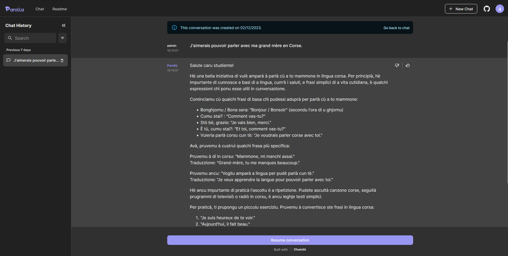

  

----- 

# Parolla

Apprendre le Corse, deviens simple et accéssible à tous.

## Experimentation

Avant que vous commenciez votre apprentissage, sachez que ceci est encore une experimentation. L'intélligence artificielle avec laquelle vous échangez peut encore faire beaucoup d'erreurs dans ce qu'elle vous dit. N'hesiter pas a mettre un :thumbsup: ou :thumbsdown: et ajouter un commentaire sur la réponse de l'IA.

## Discuter pour apprendre

Nous pensons que la discussion est la meilleure des façon d'apprendre une nouvelle language. Cependant nous avons tous rencontrer des difficultées de timidité ou de gène pour parler en Corse quand nous débutons. Parolla vous propose de vous exercer sans gène avec son professeur particulier de Corse.

## Que faire

Commencer par lui parler lui de vous. Si vous avez des difficultées a comprendre quelque chose, dîtes le clairement, il vous accompagneras jusqu'à que la notion soit maitrisé.

## Futur

Nous developons se projet de manière bénévole afin de nous même apprendre le Corse, n'hesiter pas a nous contacter si vous souhaiter vous joindre à l'aventure ou si vous avez des questions.

Nous voulons ajouter la possibilité de parler pour aller plus loin dans l'apprentissage et de passer de l'écrit à l'orale.

## Contact

Nous sommes en recherche constante de données pour améliorer l'outil, alors si vous avez accès a des cours de langue Corse ou si vous même êtes profféseur(e) de Corse.

Contacter nous a l'adress email suivante: parolla-team[@]pm.me
